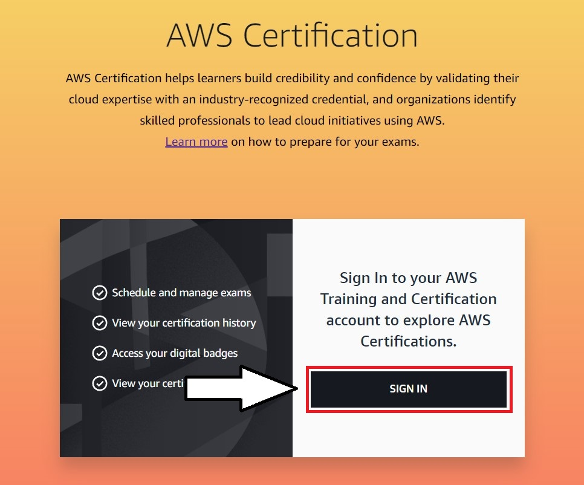
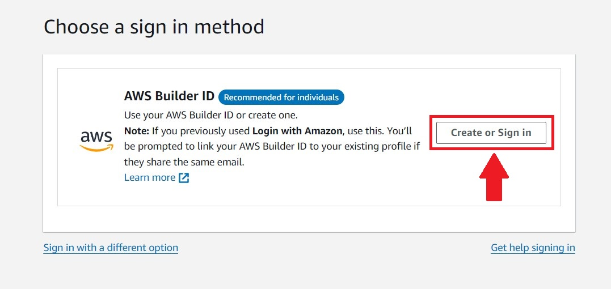
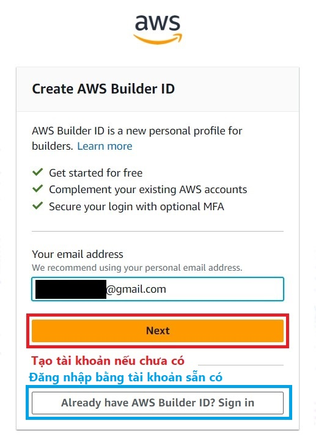
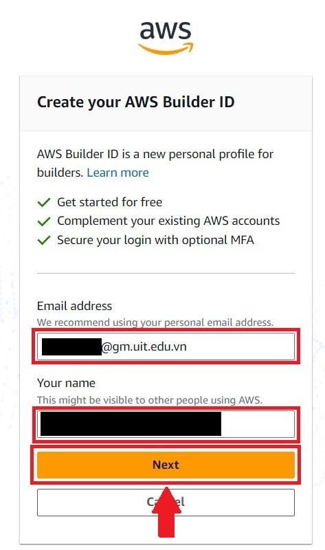
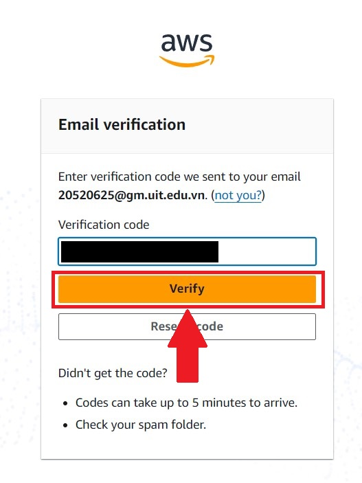
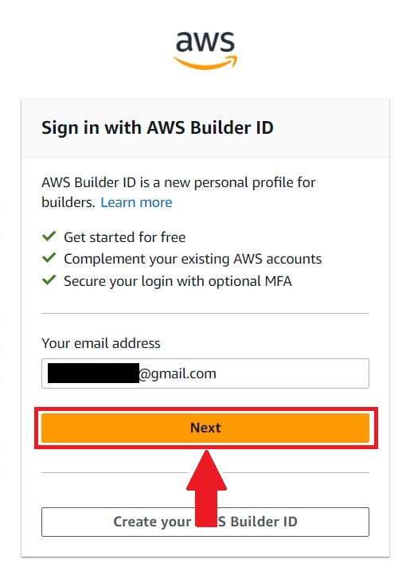
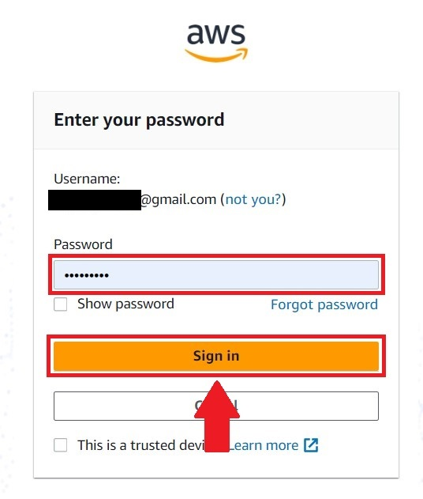

# Hướng dẫn đăng ký thi chứng chỉ AWS

Bài viết này sẽ hướng dẫn cụ thể cách đăng ký thi chứng chỉ do AWS cấp.

## 1. Đăng nhập hoặc đăng ký
Để tạo tài khoản mới, đầu tiên, hãy truy cập trang sau:
[https://www.aws.training/Certification](https://www.aws.training/Certification)

Tại màn hình chính, chọn **_Sign In_**.

Trong trang tiếp theo, giữ phương thức đăng nhập bằng _AWS Builder ID_ nếu bạn không phải nhân viên AWS. Nhấn vào _Create or Sign in_.

Tại khung **_Create AWS Builder ID_**, nhập email và nhấn _Next_ để tạo tài khoản mới (xem phần [1.1](#11-đăng-ký-tài-khoản-mới)) hoặc _Already have AWS Builder ID ? Sign in_ để đăng nhập vào tài khoản đã có (xem phần [1.2](#12-đăng-nhập)).

### 1.1. Đăng ký tài khoản mới
Tại khung tạo tài khoản, ngoài e-mail đã nhập ở bước trước, nhập tên người dùng và nhấn _Next_.

Một email với mã xác nhận (6 chữ số) được gửi đến e-mail đăng ký. Kiểm tra và nhập mã vào khung _Verification code_ ở khung tiếp theo.

Nhấn vào _Verify_ và hoàn tất việc tạo tài khoản.

### 1.2. Đăng nhập
Nếu đã có sẵn tài khoản AWS Builder, Bạn có thể làm các bước sau:

Tại khung _Sign in with AWS Builder ID_, nhấn _Next_ nếu bạn không có thay đổi gì cho e-mail đã nhập:

Ở khung tiếp theo, nhập mật khẩu của bạn.

Nếu đăng nhập thành công, bạn sẽ được chuyển tới màn hình sau:

![[06-SignSuccess.jpg]](./IMG/06-SignSuccess.jpg)

Nhấn vào _Go to your account_ để chuyển tới trang CertMetrics và đăng ký thi.

## 2. Đăng ký thi
Tại trang CertMetrics, chọn _Exam Registration_ tại thanh điều hướng bên trái.

![[07-CertMetric.jpg]](./IMG/07-CertMetric.jpg)

Chọn một bài thi theo mong muốn của bạn và nhấn vào _Authorize_ để được cho phép đăng ký.

![[08-CertMetric2.jpg]](./IMG/08-CertMetric2.jpg)

Bài thi được cấp quyền sẽ chuyển sang màu xanh lá và dòng chứ _Authorize_ được thay bằng _Schedule_, nhấn vào _Schedule_.

![[09-Schedule.jpg]](./IMG/09-Schedule.jpg)

Tại màn hình tiếp theo, chọn hình thức thi mong muốn (trực tuyến (xem phần [2.1](#21-trực-tuyến)) và tại chỗ (xem phần [2.2](#22-tại-chỗ)))

![[10-ChooseType.jpg]](./IMG/10-ChooseType.jpg)

### 2.1. Trực tuyến
Hình thức thi này yêu cầu không gian riêng tư và yên tĩnh. Nhấn _Next_ để tới phần tiếp theo.

![[11.1-Online.jpg]](./IMG/11.1-Online.jpg)

Chọn ngôn ngữ bạn mong muốn và nhấn _Next_

![[11.2-Language-Online.jpg]](./IMG/11.2-Language-Online.jpg)

Với hình thức thi trực tuyến, bạn cần đồng ý với một số chính sách dữ liệu. Đánh tích vào tất cả các ô, kéo xuống và chọn _Next_.

![[11.3-Policies-Online.jpg]](./IMG/11.3-Policies-Online.jpg)

Chọn ngôn ngữ của người đọc hướng dẫn.

![[11.4-ProcLanguage-Online.jpg]](./IMG/11.4-ProcLanguage-Online.jpg)

Xác nhận múi giờ, với _No, change the time zone_ để thay đổi và _Yes, that's right_ để xác nhận và tiếp tục.

![[11.5-Timezone.jpg]](./IMG/11.5-Timezone.jpg)

Chọn ngày thi.

![[11.6-Date.jpg]](./IMG/11.6-Date.jpg)

Chọn khung giờ thi bằng cách nhấn vào _Explore More Times_. Nếu đã chọn giờ thích hợp, nhấn vào _Book this appointment_ và thanh toán lệ phí thi (xem phần [3](#3-thanh-toán)).

![[11.7-Time.jpg]](./IMG/11.7-Time.jpg)

### 2.2. Tại chỗ
Với phần thi tại chỗ, cần tìm hiểu kỹ các vật dụng được và không được mang vào phòng thi. Nhấn _Next_ để tới bước chọn ngôn ngữ.

![[12.1-OnSite.jpg]](./IMG/12.1-OnSite.jpg)

Chọn ngôn ngữ bạn muốn đối với bài thi.

![[12.2-Language.jpg]](./IMG/12.2-Language.jpg)

Với hình thức thi tại chỗ, có ít chính sách hơn so với thi trực tuyến, kéo xuống cuối trang và nhấn _Agree_ để tiếp tục.

![[12.3-Policies.jpg]](./IMG/12.3-Policies.jpg)

Chọn tối đa 3 địa điểm thi để so sánh và chọn giờ ở mục dưới.

![[12.4-Place.jpg]](./IMG/12.4-Place.jpg)

Chọn trung tâm và xem các ngày còn cho phép đăng ký. Bạn chỉ được chọn một ngày thi tại một trung tâm.

![[12.5-Date.jpg]](./IMG/12.5-Date.jpg)

Chọn khung giờ bạn mong muốn. Nếu đã chọn giờ thích hợp, nhấn vào _Book this appointment_ và thanh toán lệ phí thi (xem phần [3](#3-thanh-toán)).

![[12.6-Time.jpg]](./IMG/12.6-Time.jpg)

## 3. Thanh toán
Tại trang Cart, bạn có thể thêm hoặc bỏ bớt bài thi muốn đăng ký. Sau khi xem tổng chi phí, chọn _Proceed to Checkout_ để xác nhận và chuyển sang các bước thanh toán tiếp theo.

![[11.8-Confirm.jpg]](./IMG/11.8-Confirm.jpg)

Tại khung _Enter payment and billing_, nhập mã giảm giá (nếu có) và nhấn _Apply_ để áp dụng mã.

![[11.9-Voucher.jpg]](./IMG/11.9-Voucher.jpg)

Chọn phương thức thanh toán và nhập thông tin.

![[11.10-Payment.jpg]](./IMG/11.10-Payment.jpg)

## 4. Kiểm tra và xác nhận
Sau khi hoàn tất việc thanh toán, kiếm tra e-mail của bạn để xem hóa đơn do chính Pearson VUE gửi.

![[13-Bill.jpg]](./IMG/13-Bill.jpg)

Vậy là việc đăng ký đã hoàn tất. Chúc bạn thi tốt !