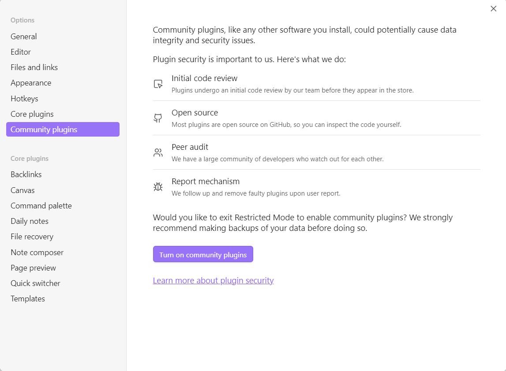
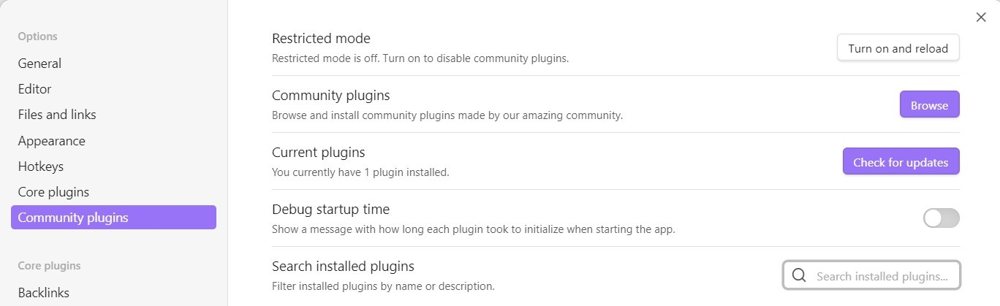
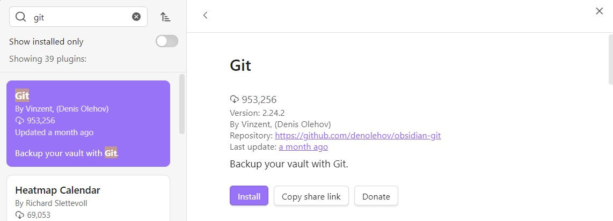
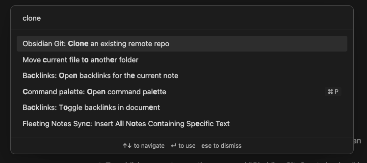

[**<< Quay về trang chủ**](/)
# Lưu trữ ghi chép trên Obsidian với Git

---
## **Git**
### 1. Git là gì ?

Git là một hệ thống quản lý phiên bản phân tán. Nó cung cấp cho mỗi lập trình viên/dự án các kho lưu trữ (repository) riêng chứa toàn bộ lịch sử thay đổi của các tệp. Mỗi khi bạn _“commit”_, Git sẽ “chụp” các tệp và tạo một snapshot cùng một tham chiếu tới snapshot đó. Để việc lưu trữ hiệu quả, nếu các tệp không thay đổi, Git sẽ không lưu trữ tệp — thay vào đó chỉ là một liên kết/tham chiếu đến phiên bản gần nhất nhận sự thay đổi. Với Git, các lập trình viên có thể cộng tác với nhau trên cùng bộ mã nguồn.

### 2. Các dịch vụ dựa trên Git hiện có:
- GitHub
- GitLab
- Gerrit
- SourceForge
- Amazon AWS CodeCommit
- v.v...
---
## **Lưu trữ ghi chép trên Obsidian với Git-GitHub**

Một nhược điểm của Obsidian là tính năng lưu trữ và đồng bộ trực tuyến _**bị tính phí**_. Tuy nhiên, vấn đề này có thể được khắc phục bằng cách sử dụng kho lưu trữ thuộc bên thứ ba.

Vì Obsidian sử dụng ngôn ngữ Markdown để đánh dấu hiển thị, các mã nguồn Markdown này có thể được lưu trữ trên các kho Git. Bài viết này chọn GitHub làm dịch vụ để lưu trữ các tài liệu Obsidian. Bạn có thể dùng GitHub Desktop với giao diện đồ họa dễ sử dụng (nếu không quen với việc thiết lập phức tạp và xử lý dòng lệnh), hoặc sử dụng giao diện dòng lệnh Git độc lập. Tuy nhiên, để việc tích hợp mã nguồn trở nên tiện hơn, bạn có thể sử dụng plugin _Git_ để tương tác trực tiếp với kho Git ngay trong quá trình làm việc trên Obsidian.

### 1. Trên GitHub

#### 1.1 - Tạo repo trên GitHub
#### 1.2 - Tạo token truy cập
2. Nhấn vào ảnh đại diện tài khoản người dùng (góc trên cùng bên phải), vào _Settings > Development Settings > Personal Access Tokens > (Khuyến khích) Fine-grained Tokens_ và chọn _Generate New Token_
3. Nhập tên, chọn thời điểm hết hạn và chủ sở hữu tài nguyên _(Resource owner)_.
4. Tại mục _Repository access_, chọn phạm vi các repo bạn muốn token truy cập vào.
5. Tại mục _Permissions_, chọn các giới hạn truy cập cho các thao tác khác nhau đối với kho mã nguồn và đối với tài khoản, trong phạm vi các repo markdown, khuyến khích không cấp quyền tác động vào tài khoản cho token. Bạn có thể tham khảo các quyền cho repo như gợi ý dưới đây hoặc tự điều chỉnh theo ý bạn: <br>
   - Cho phép truy cập: _codespaces metadata, discussions, metadata, security events, actions, administration, code, codespaces, commit statuses, deployments, environments, pull requests, repository custom properties, repository hooks, workflows_
   - Cấm truy cập các thành phần còn lại (mặc định) <br>
7. Kéo xuống dưới cùng và chọn _Generate Token_
8. Sao chép và lưu lại token ở một nơi an toàn, tránh làm mất vì token sẽ không hiển thị lại trên GitHub **bất kỳ lần nào**.
### 2. Trên máy tính

Cài đặt bản Git tương thích với hệ thống của bạn. 

_**Lưu ý:**_ Trên Windows, Obsidian sẽ gặp lỗi với đường dẫn thư mục nếu bạn sử dụng các bản Git được cung cấp qua trình quản lý gói Pacman cho môi trường MSYS2. Do đó, **CHỈ** sử dụng bản git được phân phối trên [git-scm.com](https://git-scm.com/).

### 3. Trên Obsidian

Vì _Git_ không phải một plugin được cung cấp chính thức bởi Obsidian, bạn cần tắt _Restricted Mode_ trước khi cài đặt. Để cho phép sử dụng plugin không chính thức, vào cấu hình, chọn thẻ _Community plugins_, chọn _Turn on community plugins_.



Sau khi bật, giao diện mục này sẽ thay đổi, chọn _Community Plugins > Browse_:



Tìm và cài đặt _Git_ như hình dưới, sau đó chọn _Enable_ để bật plugin.



 Tạo thư mục trống và mở trong Obsidian. Mở khung các lệnh (bằng biểu tượng màn hình dòng lệnh bên thanh trái của giao diện Obsidian hoặc phím tắt `Ctrl + P`) và nhập `Clone an existing remote repo`.
 

Nhập vào khung đầu tiên liên kết đến kho Git đã tạo. Liên kết có dạng:
```
https://<Token đã tạo ở bước trên>@github.com/<username>/<repo>.git
```
Nhập tên thư mục hiện tại vào khung tiếp theo. Tại khung thứ 3, hãy để trống, Git sẽ mặc định sao chép mọi nhánh (_branch_) của mã nguồn về thư mục hiện hành.

Sau khi kéo về xong, khởi động lại Obsidian. Giờ thì bạn đã có thể sử dụng Obsidian để ghi chú nội dung.

***Chúc các bạn thành công !***

\*Bài viết được soạn trên Obsidian